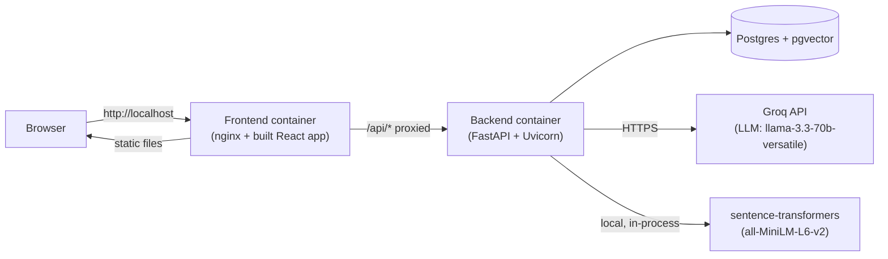
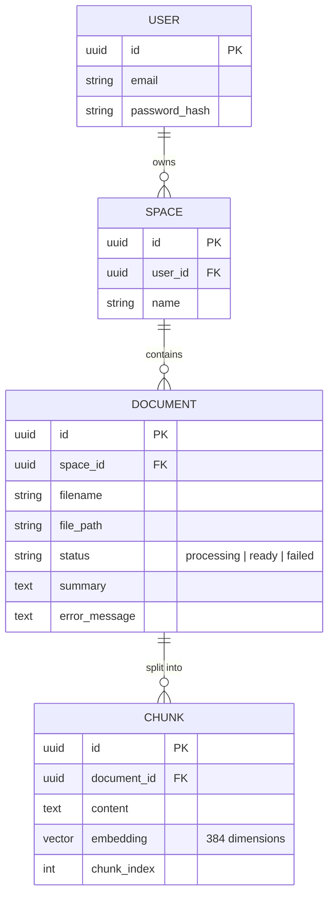
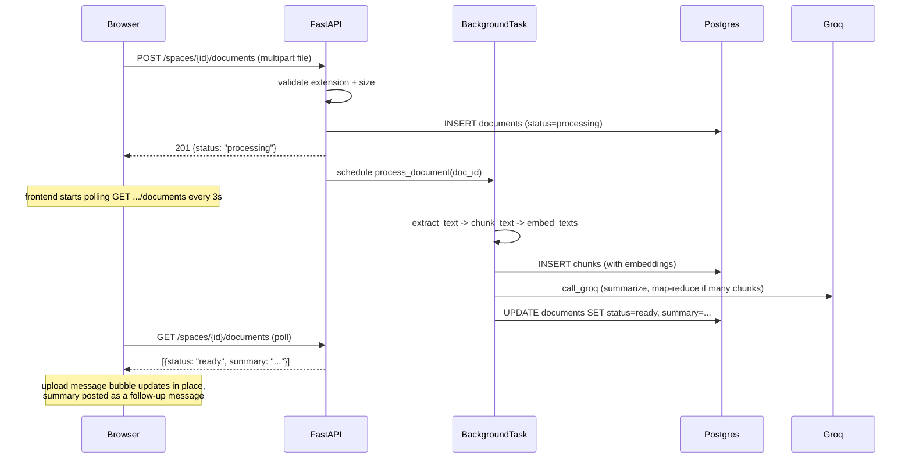
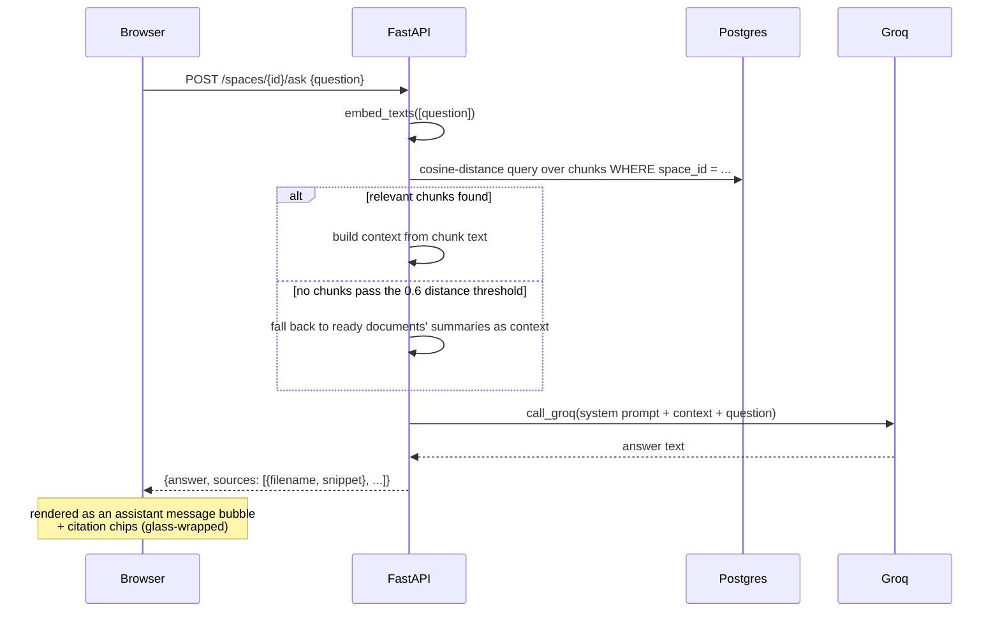

# MindSpace — Architecture & Code Walkthrough

This document explains how MindSpace actually works end to end: every backend
module, every frontend file, where each API endpoint lives, and how a
request flows through the system for each major feature (signup, document
upload/processing, and Q&A).

## 1. High-Level Architecture

Three containers, one Docker Compose stack:



- **Frontend**: React + TypeScript + Vite, built into static files, served by
  nginx. Nginx also reverse-proxies `/api/*` to the backend container, so the
  browser only ever talks to one origin (`http://localhost`) — no CORS is
  involved in the deployed stack.
- **Backend**: FastAPI (Python), talks to Postgres via SQLAlchemy, calls Groq
  for LLM text generation, and runs embeddings locally (no external API cost
  for embeddings).
- **Database**: Postgres with the `pgvector` extension — a single database
  stores users, spaces, documents, and chunk embeddings (as native `vector`
  columns), so no separate vector database is needed.

## 2. Directory Map

```
backend/
  app/
    main.py            FastAPI app, CORS, router registration, /health
    config.py           Settings (env vars) via pydantic-settings
    database.py         SQLAlchemy engine/session, init_db()
    models.py            User, Space, Document, Chunk ORM models
    auth.py              JWT + bcrypt helpers, get_current_user dependency
    schemas.py           Pydantic request/response models
    routers/
      auth.py            POST /auth/signup, /auth/login
      spaces.py          CRUD for /spaces
      documents.py       Upload + list documents within a space
      qa.py              POST /spaces/{id}/ask
    services/
      extraction.py      PDF/DOCX/TXT/MD -> plain text
      chunking.py        plain text -> overlapping word chunks
      embeddings.py      chunks -> vector embeddings (local model)
      groq_client.py     Thin wrapper around the Groq chat-completions API
      summarization.py   Chunks -> a short document summary (via Groq)
      document_pipeline.py  Orchestrates extract -> chunk -> embed -> summarize
      retrieval.py       Question embedding -> nearest chunks (pgvector)
      qa.py              Orchestrates retrieval -> Groq -> answer + sources
  tests/                 pytest suite (54+ tests), one file per module above

frontend/
  src/
    main.tsx             ReactDOM entry point
    App.tsx              Route table
    index.css            The entire design system (tokens + all component styles)
    api/                 One file per backend resource; thin fetch wrappers
      client.ts          apiRequest() — shared fetch/auth/error-handling core
      auth.ts, spaces.ts, documents.ts, qa.ts
    context/
      AuthContext.tsx    isAuthenticated state + login/signup/logout
    components/
      ProtectedRoute.tsx Redirects to /login if not authenticated
      AppShell.tsx       Sidebar (space list, new-space modal, logout) + Outlet
      LiquidGlass.tsx    Reusable SVG-refraction "glass" wrapper component
      SplashScreen.tsx   Fixed-duration splash shown once on the auth page
    pages/
      AuthPage.tsx       Splash -> login/signup form (single page, local toggle)
      SpaceDetailPage.tsx  The chat UI: messages, upload-via-attachment, Q&A
    lib/
      liquidGlass.ts     Pure helpers: SVG filter generation, feature detection
    types.ts             Shared TypeScript types matching the backend schemas
```

## 3. Backend, Module by Module

### `config.py` — Settings

A `pydantic-settings` `Settings` class reads everything from environment
variables (or a `.env` file locally). Key values: `DATABASE_URL`,
`JWT_SECRET`, `GROQ_API_KEY`, `GROQ_MODEL` (default
`llama-3.3-70b-versatile`), `EMBEDDING_MODEL_NAME` (default
`all-MiniLM-L6-v2`), `MAX_UPLOAD_SIZE_BYTES` (20MB).

### `database.py` — Engine & Session

Creates the SQLAlchemy `engine` and `SessionLocal` factory from
`DATABASE_URL`. `init_db()` (called once at FastAPI startup via the
`lifespan` context manager in `main.py`) runs `CREATE EXTENSION IF NOT
EXISTS vector` and then `Base.metadata.create_all()` — this creates any
table that doesn't already exist, so adding a new model class is enough;
there's no separate migration tool in this project.

### `models.py` — Data Model



Every table cascades on delete (deleting a `Space` deletes its `Document`s,
deleting a `Document` deletes its `Chunk`s), and every query is scoped by
`user_id`/`space_id` so one user's data is never visible to another (see
`_get_owned_space` below).

### `auth.py` — JWT & Passwords

- `hash_password` / `verify_password`: bcrypt.
- `create_access_token(user_id)`: signs a JWT (`sub: user_id`, `exp`) valid
  for 7 days by default.
- `decode_access_token(token)`: verifies and returns the user id.
- `get_current_user`: a FastAPI dependency — reads the `Authorization:
  Bearer <token>` header (via `OAuth2PasswordBearer`), decodes it, loads the
  `User` row. Every protected route depends on this.

### Routers (the actual API surface)

All routes except signup/login require `Authorization: Bearer <token>`.

| Method | Path | Purpose | File |
|---|---|---|---|
| POST | `/auth/signup` | Create a user, return a JWT | `routers/auth.py` |
| POST | `/auth/login` | Verify credentials, return a JWT | `routers/auth.py` |
| GET | `/spaces` | List the current user's spaces | `routers/spaces.py` |
| POST | `/spaces` | Create a space (`{name}`) | `routers/spaces.py` |
| GET | `/spaces/{id}` | Get one space (404 if not owned) | `routers/spaces.py` |
| DELETE | `/spaces/{id}` | Delete a space, its documents, and their files on disk | `routers/spaces.py` |
| GET | `/spaces/{id}/documents` | List documents in a space | `routers/documents.py` |
| POST | `/spaces/{id}/documents` | Upload a file (multipart), kicks off background processing | `routers/documents.py` |
| POST | `/spaces/{id}/ask` | Ask a question, get an answer + source citations | `routers/qa.py` |
| GET | `/health` | Liveness check (no auth) | `main.py` |

Every space/document/ask route first calls `_get_owned_space(db, user,
space_id)` (defined in `routers/spaces.py`, imported by the other routers) —
this is the single choke point that enforces "you can only see your own
data," raising `404` (not `403`, to avoid leaking existence) if the space
belongs to someone else or doesn't exist.

### Services (the actual logic)

**`extraction.py`** — `extract_text(file_path, file_type)`. Dispatches to
`pdfplumber` (PDF), `python-docx` (DOCX), or a plain read (TXT/MD). Raises
`ExtractionError` on unsupported types, corrupt files, or empty text.

**`chunking.py`** — `chunk_text(text, chunk_size_words=600,
overlap_words=100)`. Splits on whitespace into ~600-word chunks with 100
words of overlap between consecutive chunks (so an answer-relevant sentence
straddling a chunk boundary isn't lost).

**`embeddings.py`** — `embed_texts(texts)`. Loads
`sentence-transformers/all-MiniLM-L6-v2` once (module-level cache) and
encodes a list of strings into 384-dimensional vectors. Runs on CPU inside
the backend container — no external API call, no per-embedding cost.

**`groq_client.py`** — `call_groq(messages)`. Thin wrapper around the Groq
Python SDK's chat-completions endpoint. Retries up to 3 times with
exponential backoff on retryable status codes (429/500/502/503); wraps
everything else in a `GroqError`.

**`summarization.py`** — `summarize_document(chunks)`. If a document has 4
or fewer chunks, summarizes all of them in one Groq call. If more, it's a
map-reduce: summarize each chunk individually, then summarize the
concatenated partial summaries — keeps the prompt within Groq's context
limits regardless of document length.

**`document_pipeline.py`** — `process_document(document_id)`. The
background-task orchestrator: extract → chunk → embed → store `Chunk` rows →
summarize → mark the `Document` `ready` (or `failed` if extraction raised).
Runs in a FastAPI `BackgroundTask` after the upload request already
returned, so the user sees `status: "processing"` immediately and the
frontend polls until it flips to `ready`/`failed`.

**`retrieval.py`** — `retrieve_relevant_chunks(db, space_id,
question_embedding, k=5)`. Runs a pgvector cosine-distance query
(`Chunk.embedding.cosine_distance(...)`) scoped to the given space, returns
the top 5 chunks *below* a distance threshold of `0.6` — chunks that aren't
semantically close enough to the question are filtered out entirely rather
than risking an irrelevant/hallucinated answer.

**`qa.py` (service)** — `answer_question(db, space_id, question)`. The
actual RAG logic:
1. If the space has no `ready` documents → canned "no documents yet" message.
2. Embed the question, call `retrieve_relevant_chunks`.
3. If chunks were found → build context from their text.
4. **If no chunks passed the relevance threshold** (common for whole-document
   questions like "what is this about?", which don't resemble any single
   chunk semantically) → fall back to using each ready document's
   already-generated `summary` as context instead of giving up.
5. If neither chunks nor summaries exist → "couldn't find relevant
   information" message.
6. Otherwise, send the context + question to Groq with a system prompt
   instructing it to answer only from context and cite sources; return the
   answer plus a `sources` list (filename + snippet) for the frontend to
   render as citations.

## 4. Frontend, File by File

### Entry point & routing

`main.tsx` mounts `<App />`. `App.tsx` defines the route table:

```
/login, /signup          -> AuthPage (same component, local mode toggle)
/spaces                  -> ProtectedRoute -> AppShell -> empty-state welcome
/spaces/:spaceId          -> ProtectedRoute -> AppShell -> SpaceDetailPage
*                          -> redirect to /spaces
```

`ProtectedRoute.tsx` reads `useAuth().isAuthenticated` and redirects to
`/login` if false; otherwise renders the nested route via `<Outlet />`.

### `context/AuthContext.tsx`

Holds `isAuthenticated` (derived from whether a JWT is in `localStorage`)
and exposes `login`, `signup`, `logout`. `login`/`signup` call the
corresponding `api/auth.ts` function (which stores the returned JWT via
`setToken`), then flip `isAuthenticated` to `true`. `logout` clears the
token and flips it back to `false`.

### `api/` — the HTTP layer

`client.ts` is the only place that knows about `fetch`, the JWT header, the
base URL, and error unwrapping. Every other `api/*.ts` file is a thin,
typed wrapper:

- `auth.ts` → `signup()`, `login()`
- `spaces.ts` → `listSpaces()`, `createSpace()`, `deleteSpace()`
- `documents.ts` → `listDocuments()`, `uploadDocument()`
- `qa.ts` → `askQuestion()`

`VITE_API_URL` controls the base URL: `/api` in the Docker build (so
requests go through nginx's proxy) or `http://localhost:8000` by default for
local dev without Docker.

### `components/AppShell.tsx` — the sidebar

Fetches the user's spaces on mount, renders them as a plain list (active
one highlighted), a "+ New Space" button that opens a modal (wrapped in
`<LiquidGlass>`), and a "Logout" button. Space creation/deletion call
straight into `api/spaces.ts` and re-fetch the list.

### `components/LiquidGlass.tsx` + `lib/liquidGlass.ts` — the glass effect

This is the one genuinely non-trivial piece of frontend code, so it's worth
explaining in full:

1. On mount (and on resize, via `ResizeObserver`), it measures its own
   bounding box and calls `generateDisplacementMapDataUrl(width, height)` —
   this draws a blurred, inset, 50%-gray rounded rectangle onto an
   offscreen `<canvas>` and returns it as a PNG data URL. The gray rect
   neutralizes the interior; only the blurred edge band carries any
   displacement signal.
2. `buildLiquidGlassFilterMarkup(...)` builds an SVG `<filter>` definition:
   the displacement map image feeds three `feDisplacementMap` passes at
   staggered scales (18/12/6), each isolated to one color channel via
   `feColorMatrix`, then recombined with `feBlend mode="screen"` — this is
   what produces the subtle chromatic-aberration look at the element's
   edges.
3. The filter is applied via `backdrop-filter: url(#<generated-id>)` on the
   wrapping `<div>`, which lets the *real* content behind the element
   (chat messages scrolling past, for example) refract through it.
4. `supportsLiquidGlassRefraction()` feature-detects via `CSS.supports
   ('backdrop-filter', 'url(#a)')`. Where unsupported (Safari/Firefox), the
   component instead applies the `.liquid-glass--fallback` CSS class, which
   is a plain `backdrop-filter: blur(18px)` — same visual family, no
   distortion, but never an unstyled/broken element on any browser.

It's used in exactly three places: the chat input bar, the new-space modal,
and citation cards — all small enough to stay within the technique's
practical performance envelope (the displacement map cost scales with
element area, so it's deliberately not applied to the full-height sidebar).

### `components/SplashScreen.tsx`

A dumb, timer-only component: renders the wordmark + progress bar, and
calls `onDone()` after a fixed `SPLASH_DURATION_MS` (1800ms) plus a 300ms
fade-out. `AuthPage` uses it to gate showing the actual login/signup form.

### `pages/AuthPage.tsx`

Shows `<SplashScreen>` first; once it calls back, renders a form whose
fields/copy/validation depend on a local `mode: 'login' | 'signup'` state
(initialized from `location.pathname` so `/signup` starts in signup mode).
Submitting calls `login()` or `signup()` from `AuthContext`, navigates to
`/spaces` on success, or shows the thrown error message inline.

### `pages/SpaceDetailPage.tsx` — the chat UI

All state is local React state (`messages`, `question`, `asking`,
`readyDocCount`) — nothing here is persisted server-side beyond what the
underlying document/Q&A APIs already store. Two kinds of chat messages:

- **`UploadMessage`** — created the instant a file is picked via the
  attachment button. Calls `uploadDocument()`, then polls
  `listDocuments()` every 3 seconds while status is `"processing"`,
  updating that specific message in place until it reaches `ready` (shows
  the document's `summary` as a follow-up bubble) or `failed` (shows
  `error_message`).
- **`TextMessage`** — a user question or an assistant answer. Sending a
  question calls `askQuestion()` and appends the response (with its
  `sources`) as a new message; `sources` render as citation chips inside a
  `<LiquidGlass>` card.

The message list scrolls under a `position: absolute` `<LiquidGlass>` input
bar fixed near the bottom of `.chat-panel` — this is what makes message
text visibly scroll "behind" the glass effect.

### `index.css`

One file, no CSS-in-JS or modules. Everything is driven by CSS custom
properties defined once in `:root` (colors, radii, the glass tint/shadow),
so the whole visual language can be re-themed by changing a handful of
variables at the top of the file.

## 5. End-to-End Flows

### Signup → first space

```mermaid
sequenceDiagram
    participant B as Browser
    participant N as nginx
    participant F as FastAPI
    participant P as Postgres

    B->>N: POST /api/auth/signup {email, password}
    N->>F: POST /auth/signup
    F->>F: hash_password (bcrypt)
    F->>P: INSERT INTO users
    F->>F: create_access_token (JWT, 7-day expiry)
    F-->>B: {access_token}
    B->>B: localStorage.setItem(token); isAuthenticated = true
    B->>N: GET /api/spaces (Bearer token)
    N->>F: GET /spaces
    F->>F: get_current_user (decode JWT, load User)
    F->>P: SELECT * FROM spaces WHERE user_id = ...
    F-->>B: []
```

### Document upload → ready



### Asking a question



## 6. Deployment

`docker-compose.yml` defines three services:

- `postgres` — `pgvector/pgvector:pg16`, a named volume for data, not
  exposed to the host.
- `backend` — built from `backend/Dockerfile`, reads `DATABASE_URL`
  (pointing at the `postgres` service by its Docker network hostname),
  `JWT_SECRET`, `GROQ_API_KEY` from the root `.env`; not exposed to the
  host either — only `frontend` talks to it, over the Docker network.
- `frontend` — built from `frontend/Dockerfile` (multi-stage: `npm run
  build` then copied into an `nginx:alpine` image), the only service with a
  published port (`80:80`). `nginx.conf` proxies `/api/*` to
  `http://backend:8000/` and serves the built SPA for everything else,
  with a `client_max_body_size 20M` to match the backend's own upload
  limit.

Because the browser only ever talks to nginx on `http://localhost`, the
frontend and "backend API" are same-origin from the browser's point of
view — no CORS negotiation happens in the deployed stack. (CORS
configuration in `main.py` only matters for local dev, where the Vite dev
server on `:5173` talks directly to the backend on `:8000`.)
